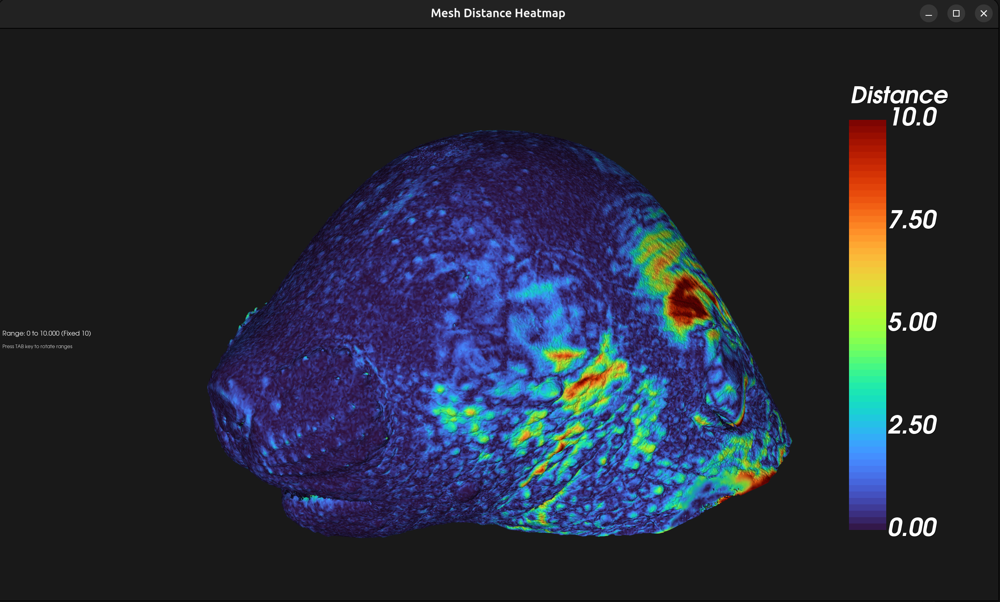

# Mesh Distance Comparison Tool



## Overview

The Mesh Distance Comparison Tool is a Python-based utility for comparing the surface geometry of two 3D objects represented as NIfTI images. It generates meshes from the images, extracts their outer shells, computes vertex-to-surface distances, and visualizes the results as a color-coded heatmap using VTK. This tool is ideal for biomedical imaging, morphometric analysis, and quality control of 3D segmentations.

## Features
- **Supports NIfTI (.nii, .nii.gz) volumetric images**
- **Automatic mesh generation** using marching cubes
- **Outer shell extraction** for accurate surface comparison
- **Vertex-to-surface distance calculation**
- **Interactive 3D visualization** with color-coded heatmap (VTK)
- **Customizable distance range cycling** (TAB key)
- **Dummy data mode** for quick testing (cube and sphere)
- **Easy setup and execution scripts**

## Requirements
- Python 3.10
- Linux (tested), should work on macOS/Windows with compatible Python/VTK
- See `requirements_mesh_comparison.txt` for Python dependencies:

```
numpy>=1.21.0
nibabel>=3.2.0
scikit-image>=0.19.0
open3d>=0.15.0
vtk>=9.0.0
matplotlib>=3.5.0
fast-simplification
pyvista
```

### Installing Python 3.10 on Ubuntu (via Deadsnakes PPA)

If your system does not have Python 3.10, you can install it using the Deadsnakes PPA with the following commands:

```bash
# 1. Update package list and install prerequisites
sudo apt update
sudo apt install -y software-properties-common

# 2. Add the Deadsnakes PPA
sudo add-apt-repository ppa:deadsnakes/ppa

# 3. Update package list again (to include Deadsnakes)
sudo apt update

# 4. Install Python 3.10
sudo apt install -y python3.10 python3.10-venv python3.10-distutils

# 5. (Optional) Check the installed version
python3.10 --version
```

## Setup

1. **Clone the repository** and enter the project directory:
   ```bash
   git clone git@github.com:Alexhal9000/nifti-mesh-distance.git
   cd nifti-mesh-distance
   ```
2. **Run the setup script** to create a virtual environment and install dependencies:
   ```bash
   ./setup.sh
   ```
   - If prompted, allow recreation of the virtual environment if needed.

## Usage

You can run the tool using the provided script:

```bash
./run.sh
```

Or manually:

```bash
source venv/bin/activate
python3.10 mesh_distance_comparison.py
```

### Data Selection
- On launch, you will be prompted to choose:
  1. **Dummy data** (a cube and a sphere, for testing)
  2. **Provided data files** (edit the hardcoded paths in `mesh_distance_comparison.py` for your own data)

### Interactive Visualization
- The tool displays the first mesh with a heatmap of distances to the second mesh.
- **Press the TAB key** to cycle through different distance range visualizations (e.g., 1/2/3 standard deviations, fixed values).
- Statistics (mean, max, std) are shown in the terminal.

## Dummy Data
- Dummy NIfTI files are generated in `dummy_data/` if you select the test mode:
  - `cube.nii.gz`: A solid cube
  - `sphere.nii.gz`: A solid sphere inside the cube

## Troubleshooting
- **VTK/OpenGL errors:** Ensure your system supports OpenGL and you have the correct drivers.
- **Dependency issues:** Re-run `./setup.sh` to reinstall dependencies.
- **Python version:** The tool requires Python 3.10. Check with `python3.10 --version`.
- **Virtual environment not found:** Run `./setup.sh` before `./run.sh`.

## License

[Add your license here]

---

*Developed by Alexhal9000 and contributors.* 